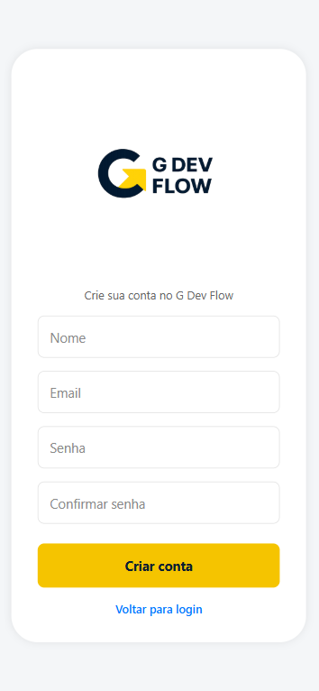
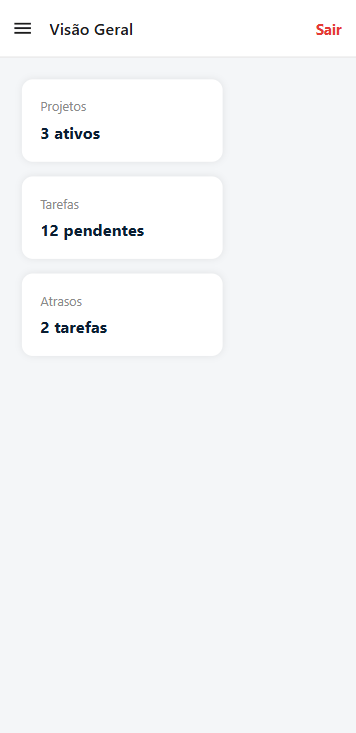

# G DEV FLOW - Frontend

Frontend da plataforma **GDevFlow**, uma aplicação para **gerenciamento de projetos e tarefas em equipes de desenvolvimento**.

O sistema permite que usuários criem projetos, organizem tarefas, acompanhem progresso e colaborem em equipes de desenvolvimento.

Este repositório contém a **interface do usuário da aplicação**, construída com **React Native + Expo**.

---
## Sumário

- [Visão Geral](#visão-geral)
- [Preview da Aplicação](#preview-da-aplicação)
- [Stack Tecnológica](#stack-tecnológica)
- [Estrutura do Projeto](#estrutura-do-projeto)
- [Integração com a API](#integração-com-a-api)
- [Configuração do Ambiente](#configuração-do-ambiente)
- [Funcionalidades Implementadas](#funcionalidades-implementadas)
- [Roadmap do Projeto](#roadmap-do-projeto)
- [Arquitetura](#arquitetura)
- [Autores](#-autores)
---
## Visão Geral

O **GDevFlow** é um sistema desenvolvido como projeto acadêmico no curso de **Engenharia de Software**, com o objetivo de apoiar equipes de desenvolvimento no planejamento e acompanhamento de projetos.

A plataforma permite:

- autenticação de usuários
- criação e gerenciamento de projetos
- organização de tarefas
- acompanhamento do progresso de atividades

---
## Preview da Aplicação

⚠️ **Esta seção será atualizada conforme as telas forem implementadas.**

### Tela de Login

### Tela de Cadastro

### Dashboard

---
## Stack Tecnológica
- **React Native**
- **Expo**
- **Expo Router**
- **TypeScript**
- **Axios**
- **AsyncStorage**
- **React Navigation (Drawer)**

---
## Estrutura do Projeto

      src
      │
      ├── app/                # Rotas da aplicação (Expo Router)
      │   ├── login.tsx
      │   ├── register.tsx
      │   ├── index.tsx
      │   └── (drawer)/
      │
      ├── components/         # Componentes reutilizáveis
      │   ├── Button.tsx
      │   ├── Input.tsx
      │   └── Logo.tsx
      │
      ├── services/           # Comunicação com a API
      │   └── api.ts
      │
      ├── styles/             # Tema e estilos globais
      │   └── theme.ts
      │
      └── assets/             # Recursos estáticos

---
## Integração com a API
Este frontend consome a API do projeto GDevFlow Backend.

Repositório da API: &nbsp;
https://github.com/ThiborMartin/gdevflow-api

A URL da API é definida através de variável de ambiente.

### Configuração do Ambiente:

1. #### Clonar o repositório
   git clone https://github.com/ThiborMartin/gdevflow-front  
   cd gdevflow-front

2. #### Instalar dependências 
   npm install 
   ou 
   yarn install

3. #### Configurar variáveis de ambiente
   Criar um arquivo .env na raiz do projeto:
   EXPO_PUBLIC_API_URL=http://localhost:8080

4. #### Executar a aplicação
   npx expo start 
   O Expo abrirá o painel para rodar o projeto em:

   - navegador

   - dispositivo físico

   - emulador Android

   - simulador iOS

---
## Funcionalidades Implementadas
- Cadastro de usuários
- Login integrado com API
- Persistência de sessão com token
- Proteção de rotas autenticadas
- Logout
- Dashboard inicial
- Navegação com menu lateral

---
## Roadmap do Projeto
**Funcionalidades planejadas para as próximas sprints:**

- gerenciamento de projetos

- gerenciamento de tarefas

- atribuição de tarefas

- acompanhamento de progresso do projeto

---
## Arquitetura
A aplicação segue uma estrutura baseada em separação de responsabilidades:

      app/ → rotas e telas da aplicação

      components/ → componentes reutilizáveis

      services/ → comunicação com backend

      styles/ → tema e estilos globais

Essa organização facilita a manutenção, escalabilidade e reutilização de código.

--- 
## 👥 Autores
- Thibor Martin &nbsp;&nbsp; 

- Gabriel  Paulon &nbsp;&nbsp;
